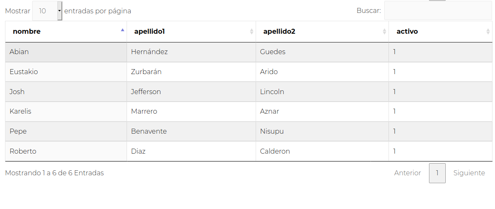
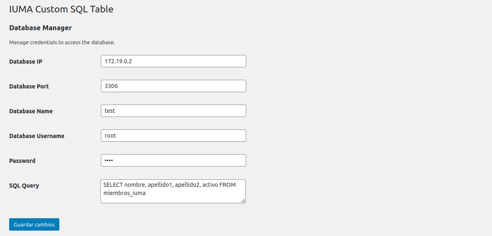
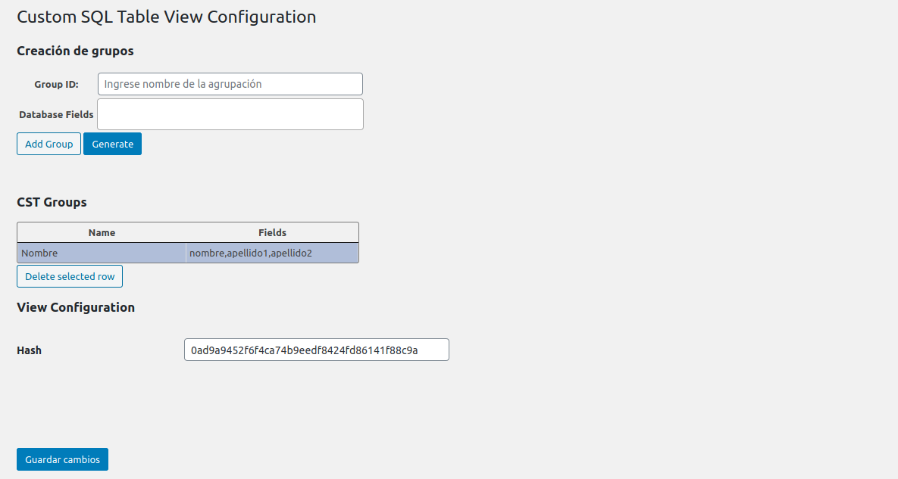
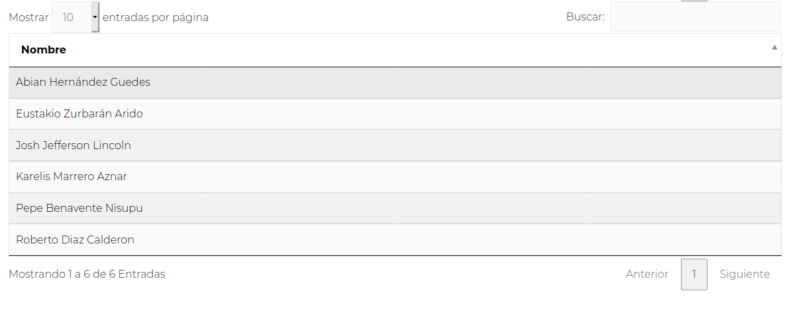

# Custom SQL Table
Este plugin permite visualizar una tabla haciendo una consulta concreta a una base de datos. Por temas de seguridad, sólo permite realizar consultas *SELECT* que tiene que ser indicado en un *textarea* que encontrarás en su panel de administración. Para su visualización es necesario utilizar el siguiente shortcode:

```php
    [iuma-custom-table]
```



# Administration Panel
El panel de administración se utiliza para configurar el acceso a la base de datos y la consulta *SQL* que se quiere realizar. La siguiente imagen muestra un ejemplo de configuración de este servicio:


En caso de tener valores no permitido de los campos, éste mostrará un mensaje de error para notificar al usuario. No se guardará la configuración del servicio hasta haber pasado el proceso de validación del formulario.

# View Configuration
Si se desea, existe la posibilidad de configurar la visualización de la tabla resultantes permitiendo agrupar distintos campos de la tabla de la base de datos y/o cambiar el nombre de estos campos:


De esta forma, se ha modificado la visualización para que la tabla sólo muestre un campo *Nombre* que agrupa los campos de la tabla de la base de datos *nombre*, *apellido1* y *apellido2*:
