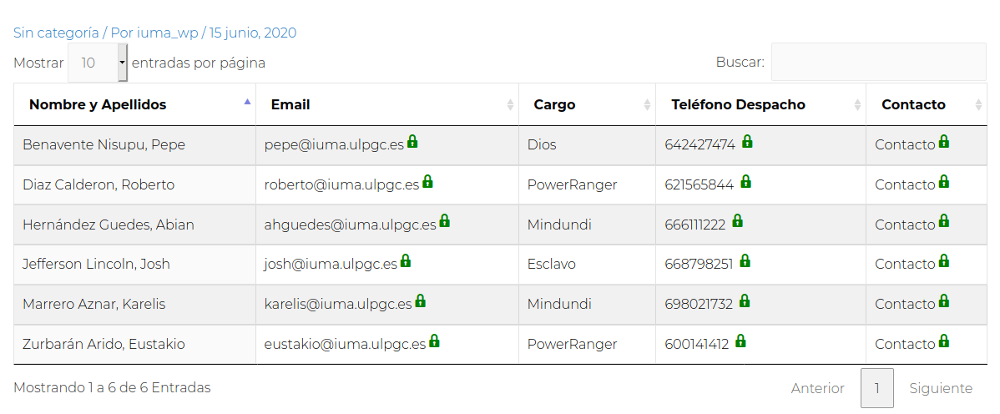

# IUMA Members
Permite visualizar a los miembros del IUMA en formato tabla haciendo uso del shortcode:
```php
    [iuma-members]
```


## Visualizar miembros de una division
En el caso de que estés interesado en visualizar a los miembros de una **división del IUMA en concreto**, el shortcode permite introductir el atributo *division* permitiendo indicar a la división que quieras visualizar:

```php
    [iuma-members division=[tag] ]
```

donde *[tag]* es un parámetro que indica el nombre de la división. A continuación se deja una lista con los posibles valores del parámetro:
* COM
* DSI
* MAGIC
* MEMS
* SICAD
* TI
* TME

## Opciones
El servicio se puede activar desde el panel de adminsitración del plugin. Una vez hecho...

# Implementación:
## [MembersController.php](MembersController.php)
Controlador principal del servicio

## [MembersOptions.php](MembersOptions.php)
...

## [MembersView.php](MembersView.php)
...

