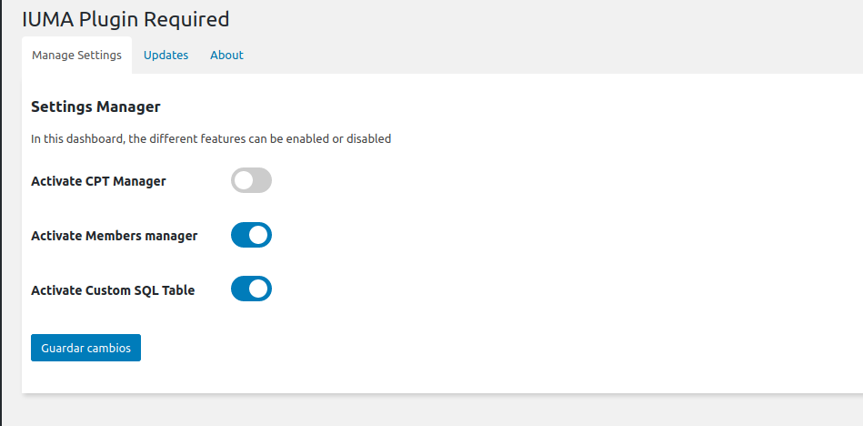

# Services Manager
Te permite activar y desactivar los servicios del plugin. Como muchos paneles de administración de otros servicios son hijos del *menu slug* de éste, es obligatorio inicializarse antes que el resto de servicios (Véase Init.php).
