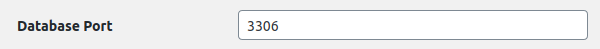
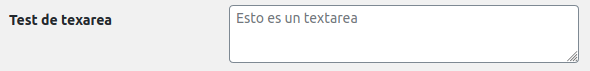
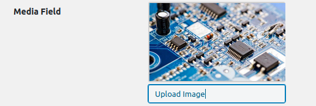

# Utils
This directory contains class with utilities which can be used in the plugin. Here you can find the following classes:

---
## [OptionFields](OptionFields.php)
This class provides the option fields which can be used in order to generate a administration option page. 

### **Functions**:
#### textField( $args ):
It is used in order to generate a text field.
* **Parameters**:
    * **Arguments**: An array wich contains the configuration of the text field
        * **Mandatory**:
            * ***'label_for'***: ID of the option field.
            * ***'option_name'***: Name of the option group
        * **Optional**:
            * ***'class'***: This argument is used in order to assign a class name to the \<input>
            * ***'type'***: This argument specifies the input type, password or text. By default, it's text.
            * ***'placeholder'***: Specifies a short hint that describes the expected value of an input field

#### Example
```php
$fields = array(
    'id' => 'db_port',
    'title' => 'Database Port',
    'callback' => array( OptionFields::class, 'textField' ),    #Here is our field
    'page' => 'iuma_members',
    'section' => 'iuma_members_index',
    'args' => array(                                            # Arguments:
        'option_name' => 'iuma_plugin_members',                 #       Mandatory
        'label_for' => 'db_port',                               #       Mandatory
        'placeholder' => 'eg. 3306'                             #       Optional
)

$this->settings->setFields( $fields );
```

#### Screenshot
 

---

#### textareaField( $args ):
It is used in order to generate a textarea field.
* **Parameters**:
    * **Arguments**: An array wich contains the configuration of the text field
        * **Mandatory**:
            * ***'label_for'***: ID of the option field.
            * ***'option_name'***: Name of the option group
        * **Optional**:
            * ***'placeholder'***: Specifies a short hint that describes the expected value of an input field
#### Example
```php
$fields = array(
    array(
        'id' => 'textarea_test',
        'title' => 'Test de texarea',
        'callback' => array( OptionFields::class, 'textareaField' ),
        'page' => $page,
        'section' => $section,
        'args' => array(
            'option_name' => $option_name,
            'label_for' => 'textarea_test',
            'placeholder' => 'Esto es un textarea'
        )
    )
)

$this->settings->setFields( $fields );
```
#### Screenshot
 

---


#### checkboxField( $args ):
It is used in order to generate a checkbox field.
* **Parameters**: an array with provides the cofiguration of this checkbox field
    * **Arguments**: An array wich contains the configuration of the text field
        * **Mandatory**:
            * ***'label_for'***: ID of the option field.
            * ***'option_name'***: Name of the option group

#### Example
```php
$fields = array(
    array(
        'id' => 'show_contact',
        'title' => 'Contact Button',
        'callback' => array( OptionFields::class, 'checkboxField' ),    #Here is our field
        'page' => 'iuma_members',
        'section' => 'iuma_members_view',
        'args' => array(                                                # Arguments:
            'option_name' => 'iuma_plugin_members',                     #       Mandatory
            'label_for' => 'show_contact'                               #       Mandatory
        )
    )
)

$this->settings->setFields( $fields );
```

#### Screenshot
 

---

#### mediaField( $args ):
It is used in order to generate a media field using Wordpress Media Uploader
* **Parameters**: an array with provides the cofiguration of this checkbox field
    * **Arguments**: An array wich contains the configuration of the media field
        * **Mandatory**:
            * ***'label_for'***: ID of the option field.
            * ***'option_name'***: Name of the option group

#### Example
```php
$fields = array(
    array(
        'id' => 'media_test',
        'title' => 'Media Field',
        'callback' => array( OptionFields::class, 'mediaField' ), #Here is our field
        'page' => 'iuma_members',
        'section' => 'iuma_members_view',
        'args' => array(                                # Arguments:
            'option_name' => 'iuma_plugin_members',     #       Mandatory
            'label_for' => 'media_test'                 #       Mandatory
        )
    )
)

$this->settings->setFields( $fields );
```
#### Screenshot
 

---