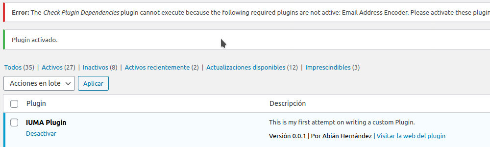

# Templates
Aquí se encuentran los templates que se usan en el plugin para visualización.

---
## admin.php
Template para la visualización del dashboard del plugin, donde se activan las distintas *features* del plugin.

---
## cpt.php
Lorem ipsum dolor sit amet, consectetur adipiscing elit. Aliquam rutrum, libero non elementum viverra, ipsum risus rutrum sem, id bibendum tortor ipsum vel arcu.

---
## members_shortcode.php
Lorem ipsum dolor sit amet, consectetur adipiscing elit. Aliquam rutrum, libero non elementum viverra, ipsum risus rutrum sem, id bibendum tortor ipsum vel arcu.

---
## members_table.php
Lorem ipsum dolor sit amet, consectetur adipiscing elit. Aliquam rutrum, libero non elementum viverra, ipsum risus rutrum sem, id bibendum tortor ipsum vel arcu.

---
## members.php
Lorem ipsum dolor sit amet, consectetur adipiscing elit. Aliquam rutrum, libero non elementum viverra, ipsum risus rutrum sem, id bibendum tortor ipsum vel arcu.

---
## missing_dependencies_notice.php
Este template se utiliza para notificar que no se encuentran activadas las dependencias del plugin. 

---